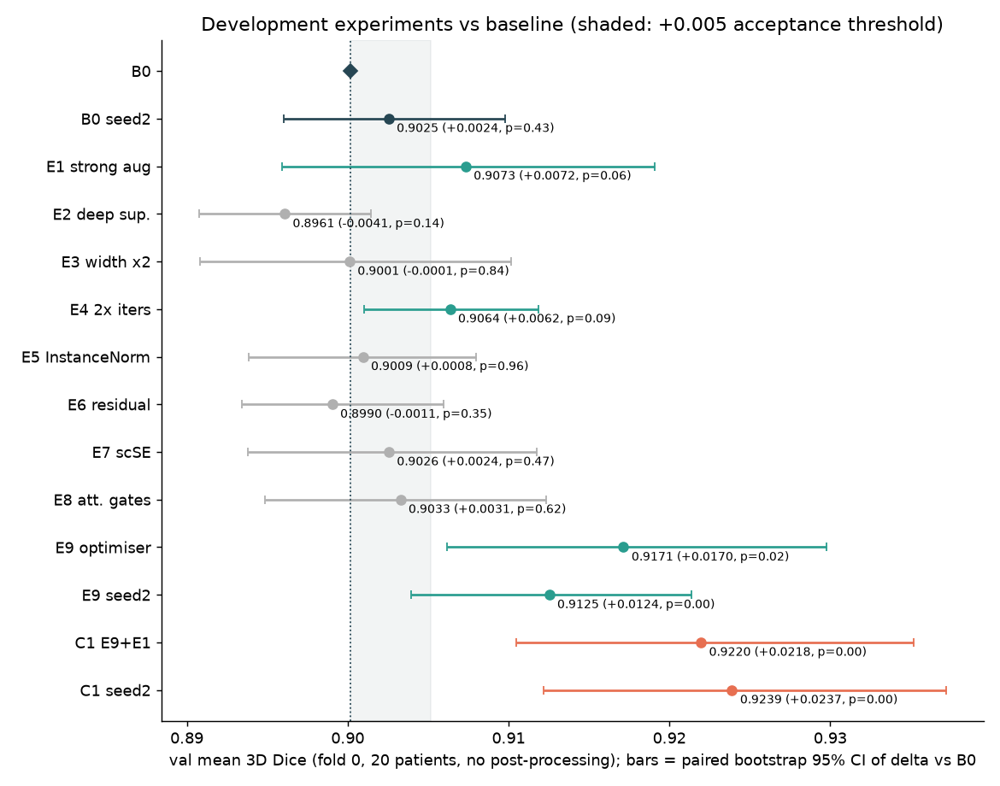
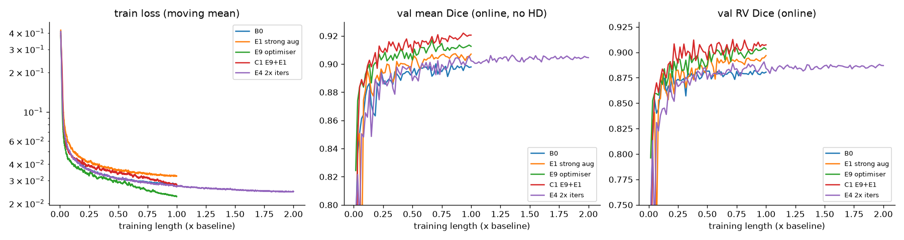
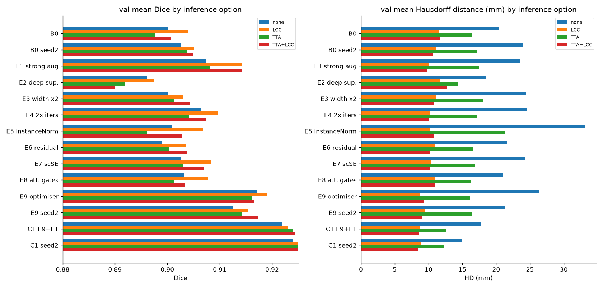
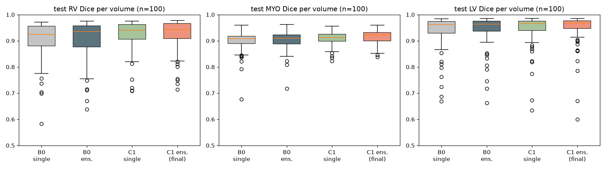
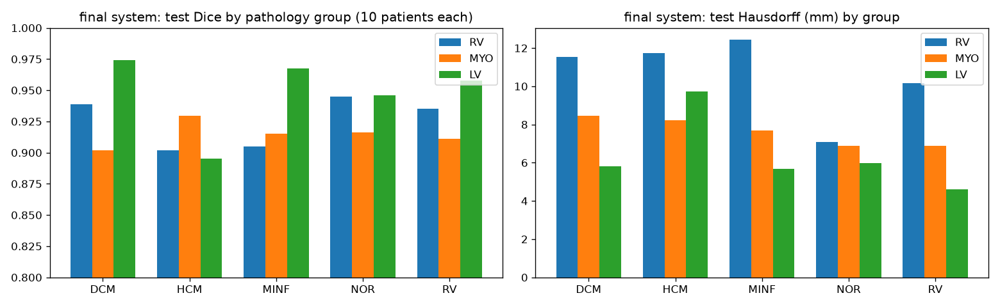

# ACDC 2D U-Net: overnight research report

*Coordinating agent: Claude Code (cloud session), with two research subagents (literature; voxel-spacing provenance). Compute: Hugging Face Jobs (T4). Dates 2026-10-03/04.*

## 1. Outcome at a glance

> **Final model.** A standard 2D U-Net (1.81M parameters, *architecture unchanged from the baseline*). It is trained with a **tuned optimiser** and **stronger 2D augmentation**, deployed as a **5-fold ensemble**, with **largest-connected-component post-processing**.
>
> **Test (patients 101-150, 100 volumes, evaluated once after the freeze): mean Dice 0.9293 [95% CI 0.923-0.935].** RV 0.925, MYO 0.915, LV 0.948. Hausdorff 8.2 mm, HD95 3.0 mm.
>
> - **ED Dice:** RV 0.951, MYO 0.907, LV 0.970.
> - **ES Dice:** RV 0.899, MYO 0.922, LV 0.926.
>
> **Against the same-protocol baseline ensemble:** +0.0105 Dice [+0.007, +0.015], p = 7.5e-9, 45/50 patients better; HD −1.35 mm. This matches the earlier estimate from the untouched confirmation folds (+0.011).

| | Validation (5-fold OOF CV, 100 training patients) | **Test (50 patients, once)** |
|---|---|---|
| B0 baseline (single models / ensemble on test) | 0.9069 Dice, HD 10.9 mm | 0.9188 Dice, HD 9.5 mm (ensemble) |
| **Final C1** | **0.9198 Dice, HD 9.2 mm** | **0.9293 Dice, HD 8.2 mm (ensemble)** |
| Δ final − B0 | +0.0129 [+0.009, +0.018] (folds 1-4 only: +0.0114) | **+0.0105 [+0.007, +0.015]** |

**What drove the gain.** Optimisation and augmentation, not architecture. Fold-0 development showed:
- B0 was **under-optimised**: the optimiser change gave +0.017 and 2× iterations gave +0.006.
- **Strong augmentation** added a further +0.005 to +0.011 on top of the optimiser change.
- Doubling the width (4× parameters), residual blocks, scSE, attention gates, InstanceNorm and deep supervision gave **no measurable benefit** (all within ±0.004).
- **LCC post-processing** roughly halves the Hausdorff distance at no cost.

**Why the loop stopped: mainly resource-limited completion, with signs of saturation.**
- The architecture-module branch was saturated: 6 capacity and module variants, none with an accepted gain.
- In the training-recipe branch, the last step C2 (C1 + 2× iterations) gave only +0.0015 (p = 0.41), below the threshold. Longer training no longer helps once the optimiser is fixed.
- The loop stopped with about $6 of credit unused, mainly because of a conservative budget estimate. C2's result shows this did not change the final selection.
- HF spend was about **$14 of the $20 credit**.

**What the evidence does not establish.**
- Superiority of this recipe over nnU-Net or published methods. Our evaluation is not an official challenge submission, and comparisons with published numbers are indirect.
- That the same modules would not help on top of the stronger recipe.
- Any clinical readiness.

**Largest remaining weakness:** end-systolic HCM. The thick myocardium leaves a near-empty LV cavity, and all 4 worst test volumes are HCM at ES (LV Dice as low as 0.60).

## 2. Objective, constraints and what was actually done

**Objective.** Build the strongest defensible **2D U-Net-family** model for ACDC cine-MRI segmentation of RV, MYO and LV, iterating on training-derived validation only and opening the test set exactly once after a freeze.

**Constraints honoured.** Every trained network is a single-slice 2D U-Net with encoder, decoder and same-resolution skips: no 2.5D or 3D context, transformers or foreign backbones. The test set (patients 101-150) was not downloaded or read before the freeze record was committed. All HF jobs had timeouts, and no endpoints or Spaces were used. No data, checkpoints or tokens are in git.

**Agents.** One coordinating agent did design, implementation, orchestration, analysis and decisions. One subagent wrote a literature review. A second recovered the official voxel spacing for training patients. There was **no independent critical-review agent**: review of hypotheses and stopping decisions was done by the coordinator against a protocol written before the first full run. This is a limitation.

## 3. Literature: what informed the design

The review covered 21 sources (searched 2026-10-03). The points that shaped decisions:

- **Official ACDC metrics** are Dice and the full **Hausdorff distance in mm**, per structure, reported separately for ED and ES (Bernard et al., TMI 2018; challenge site). HD95 is supplementary here.
- **The training pipeline matters more than architecture.** This is the explicit conclusion of nnU-Net (Isensee et al., 2021) and of Baumgartner et al. (2017) on ACDC. nnU-Net's own **2D U-Net reaches 0.9159 mean Dice in 5-fold CV** (RV 0.905, MYO 0.899, LV 0.943). That is the most comparable published 2D reference, though its pipeline and folds differ from ours.
- **nnU-Net training practices** (optimiser settings, loss, heavy spatial and intensity augmentation, deep supervision, largest-connected-component post-processing) were candidates to test.
- **SSL4MIS fully supervised 2D U-Net** (our baseline's architecture and recipe) reports about 0.91 mean Dice. It uses a different 70/10/20 split and an HD95 that ignores spacing, so its numbers are not comparable to official mm results.
- **Optional modules** (attention gates, scSE, residual blocks, UNet++) have only abstract-level evidence, mostly outside cardiac MRI, with small or uncertain gains. Each was tested as a single-factor ablation.

## 4. Dataset assessment (training partition only)

Source: SSL4MIS-preprocessed ACDC (h5). Only `ACDC_training_volumes` (patients 001-100) was read during development. The test folder was not downloaded before the freeze.

| Property | Finding |
|---|---|
| Patients / volumes / slices | 100 / 200 (ED + ES each) / 1,902; 6-18 slices per volume |
| Geometry | **Native in-plane size** (29 distinct shapes, e.g. 256x216, 224x154): not resampled or cropped. Verified voxel for voxel against the official NIfTI labels (all 200 match after transpose) |
| Spacing | Not in the h5. Recovered from the official CREATIS label headers, training patients only: through-plane 10 mm (172 volumes), 5 mm (24), 6.5 or 7 mm (4); in-plane 0.70-1.92 mm, isotropic |
| Intensities | float32 in [0, 1]: already min-max scaled per volume, so no further normalisation was applied |
| Labels | {0 bg, 1 RV, 2 MYO, 3 LV}, all four present in every volume; foreground about 3.8% of voxels (RV 1.2%, MYO 1.3%, LV 1.3%) |
| Empty or partial slices | 61 slices with no label; RV absent in 344 slices (mostly apical and basal) |
| Pathology groups | 20 patients each, in contiguous ID blocks (001-020 DCM, 021-040 HCM, 041-060 MINF, 061-080 NOR, 081-100 RV), confirmed from two independent Info.cfg tables |
| Integrity issue | **patient074 and patient076 have byte-identical images** (different labels). They are forced into the same fold to prevent leakage |
| ED / ES | Lower frame number = ED, higher = ES |

Distances are reported in **mm**, using the official header spacing. Voxel-unit distances appear only where marked.

## 5. Validation design (pre-registered)

- **Pathology-stratified 5-fold patient split**, with 074 and 076 in the same fold. Overlap is checked by assertion.
- **Fold 0 is the exploratory development fold.** All single-factor experiments ran there. **Folds 1-4 were held back as confirmation** and used only after the candidate was fixed, to compare B0 and the final config once.
- **Primary metric:** mean over RV, MYO and LV of per-volume 3D Dice, averaged over the 40 val volumes, at the best online-val checkpoint.
- **Acceptance rule:** delta ≥ max(0.005, 2σ_seed), no class drop above 0.01, and a paired per-patient Wilcoxon test with p < 0.1 (exploratory, uncorrected). The seed σ (0.0016) came from two B0 seeds.
- **Inference options** (flip TTA, largest connected component) were chosen on val by a fixed rule.
- **Budget:** $20 HF credit, with a stop-launch rule at about $17.5.

All of this was written down before the first full-length run, including one timestamped amendment made before the relevant results were seen.

## 6. Baseline and final architecture

**B0 (standard baseline)** is a standard 2D U-Net (1.81M parameters) trained slice by slice with a Dice + cross-entropy loss, SGD and light augmentation. The best checkpoint is chosen on online validation.

**Final config (C1)** uses the *same architecture*. Only two training settings change: the **optimiser configuration** and a **stronger 2D augmentation** set. At inference, the 5 fold models are ensembled and only the **largest 3D connected component per class** is kept; no test-time augmentation.

## 7. Development loop on fold 0

| ID | Change vs B0 | Params | Val Dice (RV / MYO / LV) | Mean | Δ vs B0 [95% CI], p | HD / HD95 mm (no post-proc.) | Decision |
|---|---|---|---|---|---|---|---|
| B0 | baseline | 1.81M | 0.881 / 0.886 / 0.934 | 0.9002 | – | 20.4 / 6.57 | reference |
| B0 s2 | seed 2 | 1.81M | 0.878 / 0.891 / 0.939 | 0.9025 | +0.0024 [−0.004, +0.010], 0.43 | 24.0 / 6.43 | seed noise |
| E1 | strong augmentation | 1.81M | 0.892 / 0.894 / 0.936 | 0.9073 | +0.0072 [−0.004, +0.019], 0.058 | 23.5 / 8.04 | **accepted** |
| E2 | deep supervision | 1.82M | 0.875 / 0.884 / 0.930 | 0.8961 | −0.0041 [−0.009, +0.001], 0.14 | 18.5 / 5.61 | rejected |
| E3 | width ×2 (32-512) | 7.24M | 0.878 / 0.890 / 0.933 | 0.9001 | −0.0001 [−0.009, +0.010], 0.84 | 24.4 / 6.28 | rejected |
| E4 | 2× iterations | 1.81M | 0.888 / 0.894 / 0.937 | 0.9064 | +0.0062 [+0.001, +0.012], 0.090 | 24.6 / 5.38 | accepted (2× cost) |
| E5 | InstanceNorm | 1.81M | 0.875 / 0.891 / 0.938 | 0.9009 | +0.0008 [−0.006, +0.008], 0.96 | 33.2 / 6.14 | rejected |
| E6 | residual blocks | 1.90M | 0.873 / 0.890 / 0.934 | 0.8990 | −0.0011 [−0.007, +0.006], 0.35 | 21.6 / 6.80 | rejected |
| E7 | scSE recalibration | 1.92M | 0.882 / 0.895 / 0.932 | 0.9026 | +0.0024 [−0.006, +0.012], 0.48 | 24.3 / 5.75 | rejected |
| E8 | attention gates | 1.84M | 0.879 / 0.891 / 0.939 | 0.9033 | +0.0031 [−0.005, +0.012], 0.62 | 21.0 / 6.10 | rejected |
| E9 | optimiser change | 1.81M | 0.906 / 0.901 / 0.944 | 0.9171 | **+0.0170 [+0.006, +0.030], 0.019** | 26.3 / 3.80 | **accepted** |
| E9 s2 | E9, seed 2 | 1.81M | 0.902 / 0.898 / 0.937 | 0.9125 | +0.0100 vs B0 s2, p 0.09 | 21.3 / 5.73 | confirms E9 |
| **C1** | **E9 + E1** | 1.81M | 0.910 / 0.906 / 0.950 | **0.9220** | **+0.0218 [+0.010, +0.035], <0.001** | 17.7 / 3.68 | **accepted → final** |
| C1 s2 | C1, seed 2 | 1.81M | 0.916 / 0.908 / 0.948 | 0.9239 | +0.0213 vs B0 s2, <0.001; +0.0114 vs E9 s2 (20/20 patients) | 15.0 / 3.71 | confirms C1 |
| C2 | C1 + 2× iterations | 1.81M | 0.915 / 0.908 / 0.948 | 0.9235 | vs C1: +0.0015 [−0.003, +0.006], 0.41 | 14.1 / 3.38 | rejected (below threshold, 2× cost); finished after the freeze, development only |

All runs: fold 0, about 75-90 T4-minutes and $0.5-0.6 each (E3 $0.92, E4 $1.01). Per-run metrics and costs are in `EXPERIMENTS.md`. Each p-value is a paired Wilcoxon test over 20 val patients, exploratory and uncorrected for the 13 comparisons.

**Interpretation.**
- **The baseline was under-optimised.** The two changes that make the network train harder or longer both helped: the optimiser change (E9) and doubling the iterations (E4). The effect was large and consistent across seeds.
- **Augmentation is complementary.** E1 alone helped RV most. On top of E9 it added +0.005 and +0.011 on the two seeds, the second with 20/20 patients improved.
- **Capacity and modules did nothing measurable in this regime.** 4× parameters (E3), residual blocks, scSE, attention gates, InstanceNorm and deep supervision were all within noise. This matches the literature's "pipeline over architecture". *Caveat:* the modules were tested on top of B0, not C1, so interactions with the stronger optimiser are untested.

### Inference options (no retraining)

Largest-connected-component post-processing improved Dice by +0.001 to +0.007 and **roughly halved the Hausdorff distance on every run**. For example, C1 went from 17.7 mm to 8.7 mm, and E9 from 26.3 mm to 8.7 mm. Raw HD is therefore dominated by isolated false-positive blobs far from the heart. Flip TTA changed Dice by about ±0.002 and moved HD95 in inconsistent directions, so under the pre-registered rule it was **not adopted**. Inference is LCC only.

### Error analysis (fold 0)

- **Phase:** ES is harder than ED for RV and LV, because systolic cavities are small. For B0, LV Dice is 0.962 at ED and 0.907 at ES.
- **Pathology:** the hardest are the **HCM LV** (thick walls, tiny ES cavity; B0 0.874, E9 0.886) and the **DCM RV**. E9's largest gains were RV in DCM (+0.075) and MINF (+0.054).
- **Worst volume:** for both B0 and C1 it is **patient034 ES (HCM)**, at about 0.75 mean Dice, where the LV cavity nearly vanishes at systole.
- **Qualitative figures:** worst, median and best cases by C1 mean Dice, each at the basal-most, middle and apical-most labelled slice. They contain patient images and are not published.

## 8. Confirmation on untouched folds 1-4 and 5-fold CV

Each fold model was evaluated on its own held-out val fold, so every training patient is scored exactly once (out-of-fold). The final configuration was fixed before folds 1-4 were trained. Inference uses LCC.

| | Mean Dice [95% CI] | RV | MYO | LV | ED mean | ES mean | HD (mm) | HD95 (mm) | Per-fold Dice |
|---|---|---|---|---|---|---|---|---|---|
| B0 | 0.9069 [0.899, 0.914] | 0.890 | 0.891 | 0.940 | 0.926 | 0.888 | 10.89 | 3.75 | 0.904 / 0.908 / 0.898 / 0.914 / 0.911 |
| **C1** | **0.9198 [0.915, 0.924]** | **0.907** | **0.901** | **0.951** | **0.934** | **0.906** | **9.20** | **2.93** | 0.923 / 0.917 / 0.918 / 0.917 / 0.924 |

**Paired C1 − B0, per patient:**

| Folds | Patients | Δ Dice [95% CI] | Wilcoxon p | Patients better | Δ HD (mm) |
|---|---|---|---|---|---|
| **Confirmation folds 1-4 (untouched during development)** | 80 | **+0.0114 [+0.0069, +0.0174]** | 1.2e-7 | 60/80 | −1.42 [−2.02, −0.91] |
| All 5 folds | 100 | +0.0129 [+0.0087, +0.0182] | 5e-10 | 77/100 | −1.69 [−2.27, −1.17] |

- **The improvement held on patients never used for any decision**, at about two-thirds of its fold-0 size (+0.011 vs +0.022). That shrinkage is the expected winner's-curse effect from selecting on fold 0.
- C1 is also more **stable across folds**: Dice range 0.917-0.924 vs 0.898-0.914 for B0.
- **Context:** nnU-Net's 2D U-Net reports 0.9159 mean Dice in its own 5-fold CV on the same 100 patients. Folds, preprocessing (resampling, patching) and evaluation details differ, so this is indicative only.

## 9. Freeze record

Committed 2026-10-04 03:36 UTC. Only after that commit were the test volumes downloaded and the test spacing and pathology groups fetched.

- **Model:** the 5 C1 checkpoints (folds 0-4). Their SHA-256 hashes were recorded and verified at load time.
- **Inference:** softmax averaged across the 5 models, then LCC; no TTA.
- **Metrics:** definitions as in §6 and the freeze file.
- **Comparators named in advance:** B0 5-fold ensemble, C1 single model (fold 0), and B0 single model (fold 0).
- **Integrity check:** the 100 test labels in our h5 files match the official CREATIS NIfTI labels voxel for voxel.
- **Discipline:** the evaluation ran once per named system. No checkpoint, threshold or post-processing was changed afterwards.

## 10. Final test evaluation (patients 101-150, evaluated once)

Metrics are computed per volume on the 3D voxel grid with official spacing, then averaged over 100 volumes (50 patients × ED/ES). Background is excluded. 95% CIs come from a patient-level bootstrap, keeping each patient's ED and ES together. No volume had an empty prediction.

### Final system, all metrics

| Class | Dice [95% CI] | IoU | Precision | Recall | Specificity | Voxel acc. | HD mm [95% CI] | HD95 mm | ASSD mm |
|---|---|---|---|---|---|---|---|---|---|
| RV | 0.9252 [0.913, 0.936] | 0.866 | 0.939 | 0.916 | 0.9993 | 0.9985 | 10.58 [9.4, 11.8] | 3.70 | 0.75 |
| MYO | 0.9148 [0.909, 0.920] | 0.844 | 0.906 | 0.925 | 0.9988 | 0.9979 | 7.63 [6.7, 8.6] | 2.34 | 0.42 |
| LV | 0.9480 [0.937, 0.958] | 0.906 | 0.953 | 0.948 | 0.9996 | 0.9991 | 6.36 [5.5, 7.4] | 2.95 | 0.58 |
| **Mean** | **0.9293 [0.923, 0.935]** | 0.872 | 0.933 | 0.930 | 0.9992 | 0.9985 | **8.19 [7.5, 9.0]** | 2.99 | 0.58 |

**Patient-level mean Dice:** median 0.933 (IQR 0.919-0.947), SD 0.022, minimum 0.857.

**Voxel accuracy and specificity are near 1 for every model**, because the background is about 96% of voxels. They do not discriminate between models and are reported only for completeness.

### By phase (official reporting)

| | RV Dice | MYO Dice | LV Dice | RV HD | MYO HD | LV HD |
|---|---|---|---|---|---|---|
| ED final | 0.951 | 0.907 | 0.970 | 9.2 | 7.3 | 5.4 |
| ES final | 0.899 | 0.922 | 0.926 | 11.9 | 7.9 | 7.3 |
| ED B0 ensemble | 0.936 | 0.899 | 0.968 | 11.6 | 8.6 | 5.5 |
| ES B0 ensemble | 0.885 | 0.906 | 0.919 | 13.3 | 9.5 | 8.8 |

### Final system vs named comparators (same frozen inference)

| System | Mean Dice [95% CI] | RV | MYO | LV | HD mm | HD95 mm |
|---|---|---|---|---|---|---|
| B0 single (fold 0) | 0.9142 [0.905, 0.922] | 0.906 | 0.898 | 0.939 | 10.09 | 4.02 |
| B0 5-fold ensemble | 0.9188 [0.910, 0.927] | 0.911 | 0.903 | 0.943 | 9.54 | 3.71 |
| C1 single (fold 0) | 0.9268 [0.920, 0.933] | 0.925 | 0.910 | 0.945 | 8.88 | 3.03 |
| **C1 5-fold ensemble (final)** | **0.9293 [0.923, 0.935]** | **0.925** | **0.915** | **0.948** | **8.19** | **2.99** |

**Paired, per patient (n = 50):**

| Comparison | Δ Dice [95% CI] | p | Patients better | Δ HD (mm) [95% CI] |
|---|---|---|---|---|
| Final vs B0 ensemble | +0.0105 [+0.007, +0.015] | 7.5e-9 | 45/50 | −1.35 [−1.83, −0.89] |
| Recipe effect (C1 vs B0, single models) | +0.0126 [+0.008, +0.018] | 1.6e-9 | 44/50 | −1.21 [−1.79, −0.63] |
| Ensembling (C1 ens vs single) | +0.0026 [+0.0005, +0.005] | 0.006 | 34/50 | −0.69 [−1.05, −0.34] |

### By pathology group (official Info.cfg, 10 test patients each)

**HCM is the weakest group** (LV 0.895, LV HD 9.7 mm). The 5 worst test volumes are:
- patient108 ES (HCM): LV 0.60
- patient142 ES (HCM): LV 0.67
- patient114 ES (HCM): RV 0.75, LV 0.79
- patient116 ES (HCM): RV 0.71
- patient126 ES (RV group): RV 0.81

This is the same failure mode found on validation (patient034 ES, HCM): at end-systole the hypertrophied myocardium nearly closes the LV cavity, so a small cavity mask produces a large relative Dice error. *This is a test-informed observation and has not been acted on* (see §14).

### Validation-to-test

- **Test scores are higher than CV** (0.929 vs 0.920 for the final system; B0 0.919 vs 0.907). The difference holds for both systems, so it is not a selection effect.
- **Plausible reasons:**
  - the ensemble is trained on all 100 patients, while each CV model saw only 80;
  - test-set difficulty differs.
- **The relative gain is consistent across stages:** +0.011 (confirmation folds), +0.013 (CV), +0.0105 (test).

### Relation to published results (indirect)

The ACDC leaderboard winner (Isensee et al., a 2D+3D U-Net ensemble) reported per-phase test Dice and HD:

| | LV ED / ES | RV ED / ES | MYO ED / ES |
|---|---|---|---|
| Dice | 0.967 / 0.928 | 0.946 / 0.904 | 0.896 / 0.919 |
| HD (mm) | 5.5 / 6.9 | 8.8 / 11.4 | 7.6 / 7.1 |

Our 2D-only ensemble lands in the same range:

| | LV ED / ES | RV ED / ES | MYO ED / ES |
|---|---|---|---|
| Dice | 0.970 / 0.926 | 0.951 / 0.899 | 0.907 / 0.922 |
| HD (mm) | 5.4 / 7.3 | 9.2 / 11.9 | 7.3 / 7.9 |

These are **not directly comparable**:
- ours is not an official submission, and was scored with our own implementation of the metrics on the released test labels;
- the challenge entries differ in pipeline and training data use.

We do not claim parity with or superiority over published methods.

## 11. Compute and cost

| Item | Jobs | T4 time | Cost (from in-job wall clock × $0.40/h) |
|---|---|---|---|
| Smoke tests (Mac + cloud) | 2 | ~7 min | ~$0.04 |
| Fold-0 development (B0, B0s2, E1-E9, E9s2, C1, C1s2) | 14 | 21.2 h | $8.50 |
| C2 (development only) | 1 | 2.8 h | $1.11 |
| Confirmation: B0 and C1 on folds 1-4 | 8 | 10.6 h | $4.24 |
| Container start-up / pip overhead (estimate) | – | ~0.8 h | ~$0.3 |
| Test evaluation (CPU in this session) | 0 | – | $0 |
| **Total** | **25** | ~35 h | **≈ $14.2 of the $20 credit** |

- Up to 11 jobs ran concurrently. All jobs had timeouts.
- A standard run takes about 75-90 min on a T4.
- Inference for the 5-model ensemble took 243 s for 100 test volumes on CPU, including metrics.
- **Spend vs plan:** the in-session estimate was conservative and ran about $2 above the measured costs. As a result, about $6 of credit is unused. Confirming C2 on folds 1-4 would have fitted, but C2 then failed the fold-0 rule (+0.0015), so the final selection would not have changed. This is still a planning error, reported as such.
- **Incident:** HF's commit rate limit (128 commits/hour) was hit once, because each file was uploaded as its own commit. Three metadata files of one confirmation run (C1 fold 3) failed to upload. They were rebuilt from the run's history, metrics and job ID, The checkpoint and metrics uploaded normally.

## 12. Limitations

- **Validation reuse.** About 13 hypotheses were compared on the same 20 fold-0 patients, and the best online-val checkpoint was picked from 60 noisy evaluations. Fold-0 numbers are therefore optimistic. The untouched folds 1-4 and the test set guard against this.
- **No independent review agent.** Decisions were made by the coordinating agent against the pre-registered rule.
- **Modules tested only in the B0 regime.** Their interaction with the improved optimiser is unknown.
- **Single seed for the confirmation folds and ensemble members.**
- **Distance metrics.** They are computed on the 3D voxel grid with anisotropic spacing (5-10 mm through-plane), as in the official evaluation. Empty predictions would be penalised with the volume diagonal, but none occurred.
- **No clinical indices** (EF, volumes) were computed, and a segmentation benchmark does not imply clinical readiness.

## 13. Reproducibility

The training code, configurations, launch scripts and the agent prompt/protocol are kept private and are not part of this repository. Every run recorded its commit, config hash, environment and checkpoints; these records are available on request.

## 14. Next experiments (2D U-Net family only)

These are prioritised, all within the 2D U-Net family. Items 1-4 come from validation evidence; item 5 is **motivated by test observations** and would need a fresh evaluation set or new CV before any unbiased claim.

| # | Observed problem / evidence | Intervention | Why still a 2D U-Net | Expected effect / trade-off | Cost | Validation and acceptance |
|---|---|---|---|---|---|---|
| 1 | With C1, flip TTA and 2× iterations each add about +0.002 to +0.005 on fold 0, but neither passes the rule alone | Pre-register a combined "C1 + 2× iterations + TTA" candidate and test it on **fresh folds or more seeds**, not fold 0 again | Unchanged network | +0.003 to +0.006 Dice; 2× train and 4× inference cost | ~$4.5 | OOF CV vs C1 (≥ 0.005, p < 0.1) |
| 2 | Modules were tested only in the weak B0 regime; scSE showed MYO +0.009 (p = 0.08) | Re-test **scSE and attention gates on top of C1** | Convolutional recalibration and gating inside the U-Net | Probably small; maybe MYO | ~$1.2 on fold 0, then CV | Paired vs C1 on fold 0, then folds 1-4 |
| 3 | Augmentation helped most on RV; nnU-Net uses wider ranges plus blur and low-resolution simulation | Full nnU-Net 2D augmentation set and elastic deformation as separate ablations | Data pipeline only | +0.002 to +0.005 | ~$1.2 | As above |
| 4 | HD is dominated by distant false positives, and LCC fixes most of them | Add a 2D boundary or Hausdorff-aware loss term (e.g. boundary loss with Dice+CE) | Loss only | Lower HD; possible small Dice cost | ~$0.6 | Must not lower Dice by > 0.002 |
| 5 *(test-informed)* | ES HCM LV cavities are under-segmented, on val (patient034) and test (4 worst volumes) | Class-balanced or small-structure-aware loss weighting, or oversampling ES apical slices | Loss and sampling only | Better ES LV; risk of FP cavities | ~$0.6 + CV | Train/val only; the test set is now consumed for unbiased selection |

Also: more seeds per configuration to tighten the decision threshold, and an independent review agent for hypotheses and stopping decisions.
